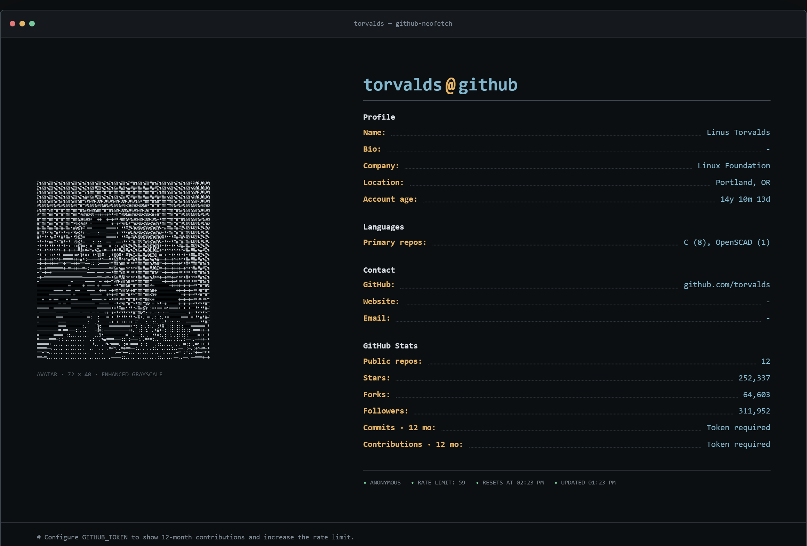

# GitHub Neofetch

把 GitHub 公开资料、仓库统计和头像渲染成一张终端风格名片。

**在线体验：[github-neofetch.vercel.app](https://github-neofetch.vercel.app/)**

[](https://github-neofetch.vercel.app/?user=torvalds)

## 功能

- GitHub 头像在服务端转换为高密度 ASCII 图像
- 聚合公开仓库的 Stars、Forks 和主要语言
- 配置 Token 后显示最近 12 个月 Commits / Contributions
- 支持下载完整终端资料卡 PNG 和包含 ASCII 头像的 TXT
- 复制结果包含完整 ASCII 头像与资料统计
- 提供深色、浅色和经典绿色终端主题
- 支持中文与英文界面切换
- 提供 `40×22`、`56×30`、`72×40` 三档 ASCII 清晰度
- 支持查询历史、方向键选择、历史清空和分享链接
- 显示 GitHub API 剩余额度及重置时间
- 适配桌面端和移动端布局
- 部分统计失败时仍可展示基础资料

## 使用

打开[在线页面](https://github-neofetch.vercel.app/)，输入 GitHub 用户名并点击“运行”。也可以通过查询参数直接分享指定用户：

```text
https://github-neofetch.vercel.app/?user=torvalds
```

查询后可使用资料卡右上角的操作按钮复制完整文本、下载 TXT 或导出双倍分辨率 PNG。页面顶部工具栏可切换主题、语言和 ASCII 清晰度；在用户名输入框中按上下方向键可选择最近查询。

## 本地运行

需要 Node.js 20.9 或更高版本。

```bash
npm install
copy .env.example .env.local
npm run dev
```

打开 `http://localhost:3000`。不配置 Token 也能查询基础资料，但 GitHub 匿名 REST API 的请求额度较低，且不会显示贡献统计。

## GitHub Token

在 `.env.local` 中设置服务端环境变量：

```env
GITHUB_TOKEN=github_pat_xxx
```

不要使用 `NEXT_PUBLIC_GITHUB_TOKEN`，否则 Token 会进入浏览器代码。建议使用只读的 fine-grained token。

## GitHub API 限额

GitHub Token 不会按查询次数“用完”，项目消耗的是 GitHub 按小时恢复的 API 请求额度：

| 请求类型 | 每小时限额 |
| --- | ---: |
| 未认证 REST API | 60 次（按来源 IP 计算） |
| 使用个人 Token 的 REST API | 5,000 次（按用户计算） |
| 使用个人 Token 的 GraphQL API | 5,000 points（独立计算） |

一次未命中缓存的查询通常会产生：

- 1 次 REST 请求读取用户资料。
- 每 100 个公开仓库约 1 次 REST 请求读取仓库列表，最多读取 10 页。
- 配置 Token 时，额外执行 1 次 GraphQL 请求读取最近 12 个月贡献。
- 1 次头像 CDN 下载，用于服务端生成 ASCII 图像；这不计入 REST API 核心额度。

例如，不超过 100 个仓库的账号通常消耗 2 次 REST 请求；约 264 个仓库的账号通常消耗 4 次 REST 请求。线上所有访客共用服务端配置的 `GITHUB_TOKEN` 配额。

完整查询结果缓存 15 分钟，GitHub REST 数据缓存 15 分钟，头像文件缓存 24 小时。同一用户名短时间内重复查询通常不会重复消耗完整的 GitHub API 请求。具体规则以 [GitHub REST API rate limits](https://docs.github.com/en/rest/using-the-rest-api/rate-limits-for-the-rest-api) 和 [GitHub GraphQL API rate limits](https://docs.github.com/en/graphql/overview/rate-limits-and-query-limits-for-the-graphql-api) 为准。

## 数据说明

- Stars / Forks 聚合用户拥有的公开仓库，最多读取 1000 个。
- Languages 按非 Fork 仓库的 primary language 统计仓库数量，不代表代码行数。
- Contributions 通过 GitHub GraphQL API 查询最近 12 个月数据，需要 Token。
- GitHub API 不提供 OS、IDE、爱好或全局代码行数，因此页面不会推测这些字段。
